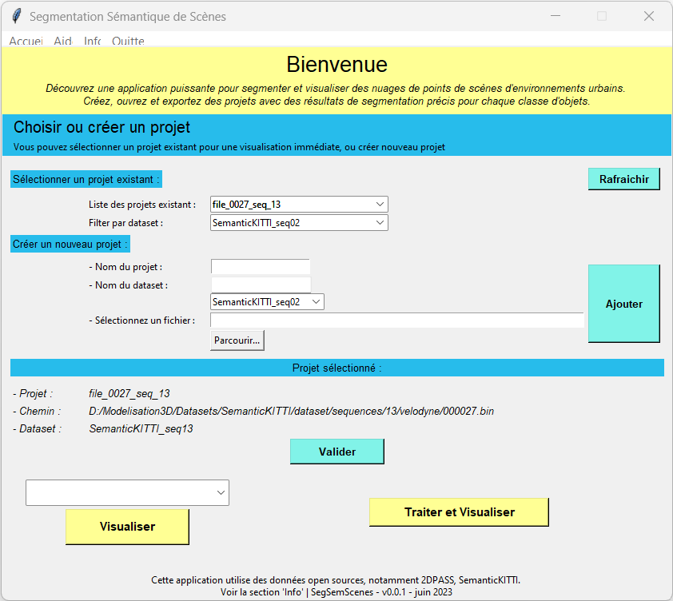

# Traitement_nuages_de_points
Présentation de l'application de traitement de nuages de points par segmentation sémantique.

Projet de recherche de mon alternance au L@bISEN et présenté comme projet chef-d'œuvre pour l'obtention de mon diplôme de développeuse en intelligence artificielle.
- **[Présention](https://drive.google.com/file/d/1HWaCDoZdQkt2sv8ooS2gg-9OwQ0G_HAK/view?usp=sharing)** 
    
 

- **[Vidéo de présentation](https://drive.google.com/file/d/1mqZdktI6f4tK4OHqnsfaPELKAVFVmtPQ/view?usp=sharing)** 
    

